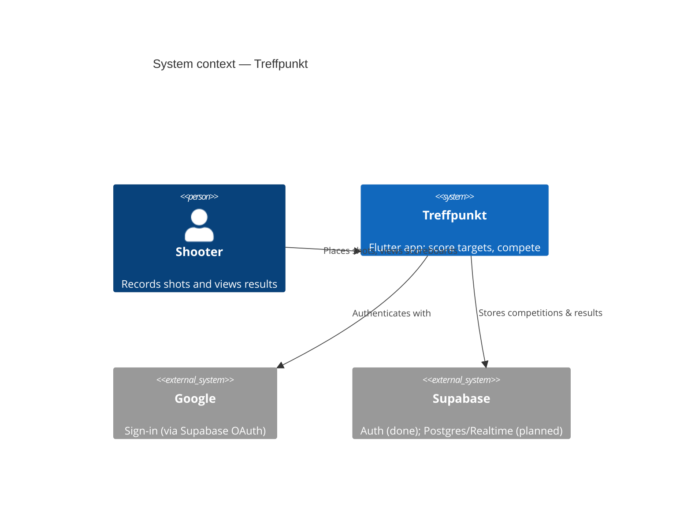
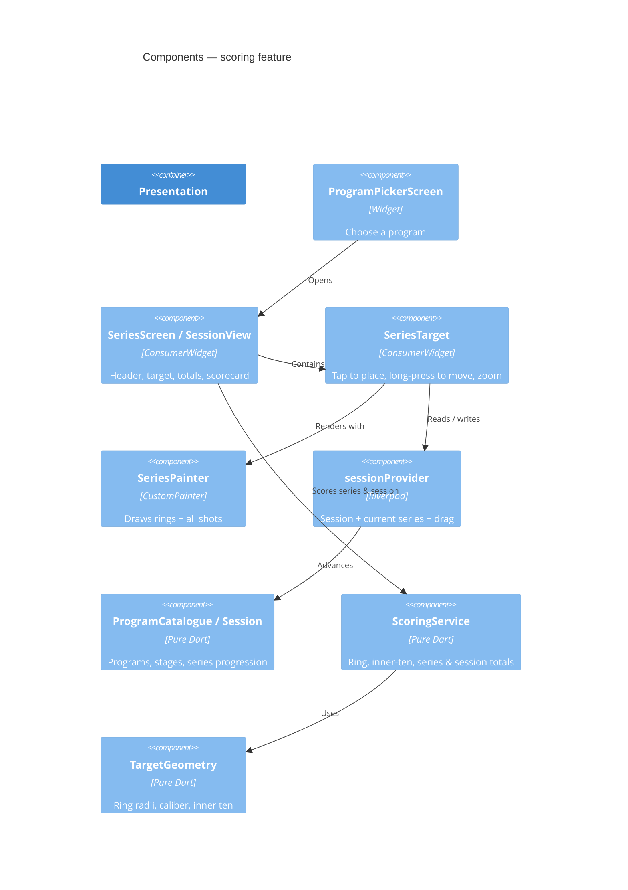

# Architecture

Treffpunkt is a Flutter app organised feature-first, with a **pure-Dart domain
layer** so the scoring rules can be tested in isolation. The backend (Supabase)
arrives with authentication at spec 0003 and the data layer at spec 0010; it is
shown as *planned* below.

## System context (C4)



## Containers (C4)


## Components — scoring feature (C4)



## Layers and folders

```
lib/features/<feature>/
  domain/        pure Dart: entities and rules (no Flutter imports)
  data/          repositories, Supabase access (planned)
  presentation/  widgets, painters, Riverpod providers
lib/core/        shared building blocks
lib/config/      theming, constants
```

Rule of thumb: dependencies point **inward**. Presentation and data depend on
the domain; the domain depends on nothing Flutter-specific.

## The coordinate model

Scoring works in millimetres with the target centre at the origin. A
[`Shot`](../specs/0001-10m-air-rifle-target-and-scoring.md) is an `(dx, dy)`
offset in mm; the presentation layer converts screen taps to millimetres and
back. Keeping the domain in real-world units makes it independent of screen size
and trivial to test.

## Responsive layout

Every screen caps its content to a comfortable width and centres it, so nothing
stretches edge-to-edge on a wide desktop, tablet or browser window. The shooting
screen (`SessionView`) goes a step further: a `LayoutBuilder` switches between a
single stacked column on narrow screens and, above a ~900 px breakpoint, a
side-by-side layout with the target on the left and the shot list / totals on
the right. The narrow layout is the phone view and is left unchanged.

## Accessibility

The presentation layer adds screen-reader semantics so the app is usable with
TalkBack / VoiceOver. The target is wrapped in `Semantics` with a spoken label;
the score cards, shot rows, stage header and stage-score rows wrap their visual
content in `Semantics(label: …)` + `ExcludeSemantics`, so a screen reader reads
one clear phrase (the value spoken in words) instead of the loose on-screen
digits. Buttons carry tooltips that double as their accessible labels. Labels
are written in Norwegian to match the spoken UI.

## Authentication (spec 0003)

Sign-in sits behind an `AuthRepository` seam in `lib/features/auth`:

- `domain/` — `AppUser`, a sealed `AuthStatus` (`SignedOut` / `SignedIn`), and
  the `AuthRepository` interface (no Supabase types).
- `data/supabase_auth_repository.dart` — the only file importing
  `supabase_flutter`; maps Supabase sessions to `AuthStatus` and runs Google
  OAuth. Excluded from automated tests, verified manually.
- `presentation/` — `authStateChangesProvider` (the authoritative signed-in
  truth), an `AuthController` for per-action loading/error, an `AuthGate` that
  shows the sign-in screen or the app, and a sign-out action.

`main()` is the only place the real repository and `Supabase.initialize` exist;
tests and the integration harness boot through `runTreffpunkt(fakeRepository)`,
so the whole feature runs headlessly.
