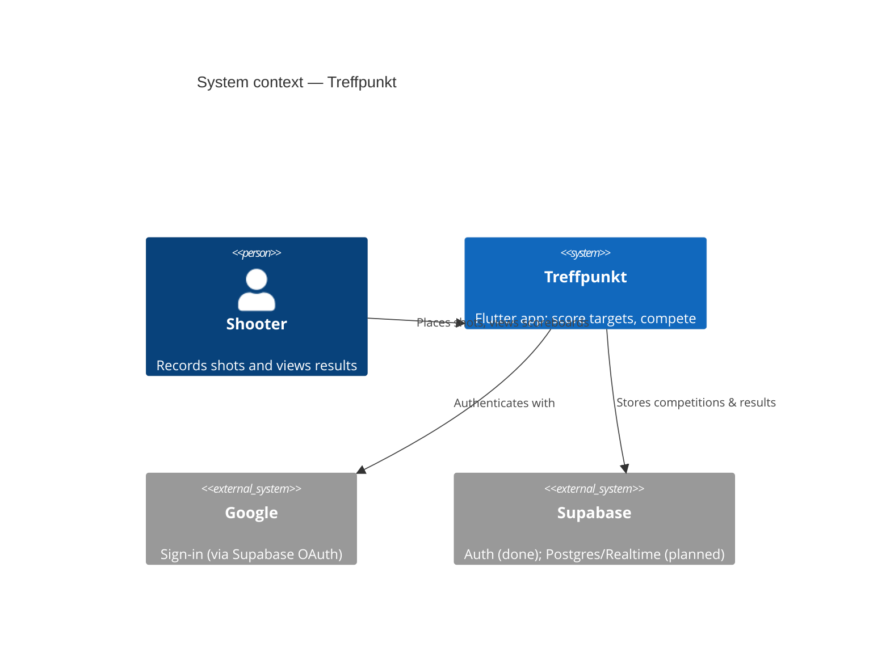
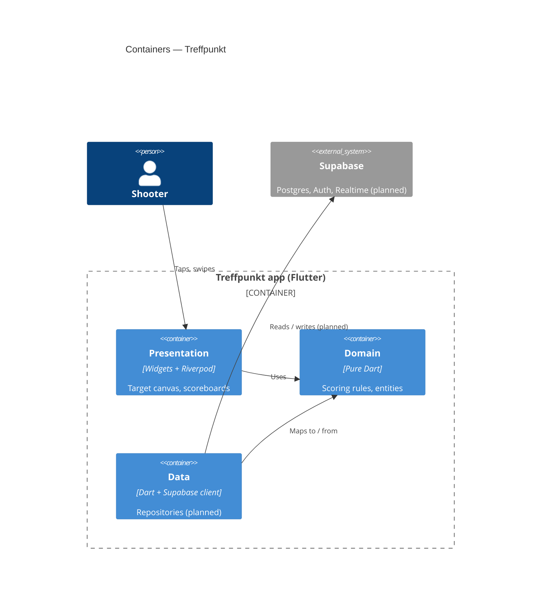
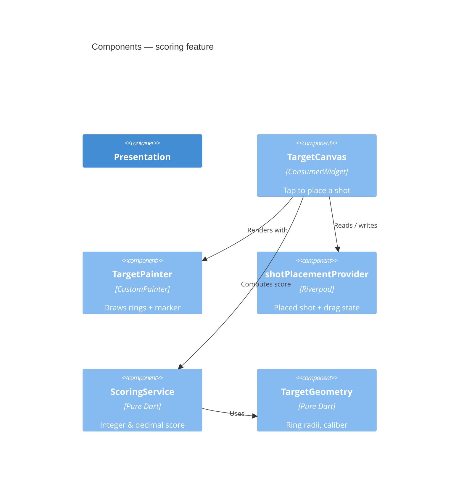

# Architecture

Treffpunkt is a Flutter app organised feature-first, with a **pure-Dart domain
layer** so the scoring rules can be tested in isolation. The backend (Supabase)
arrives at spec 0002; it is shown as *planned* below.

## System context (C4)



## Containers (C4)



## Components — scoring feature (C4)



## Layers and folders

```
lib/features/<feature>/
  domain/        pure Dart: entities and rules (no Flutter imports)
  data/          repositories, Supabase access (planned)
  presentation/  widgets, painters, Riverpod providers
lib/core/        shared building blocks
lib/config/      theming, constants
```

Rule of thumb: dependencies point **inward**. Presentation and data depend on
the domain; the domain depends on nothing Flutter-specific.

## The coordinate model

Scoring works in millimetres with the target centre at the origin. A
[`Shot`](../specs/0001-10m-air-rifle-target-and-scoring.md) is an `(dx, dy)`
offset in mm; the presentation layer converts screen taps to millimetres and
back. Keeping the domain in real-world units makes it independent of screen size
and trivial to test.

## Authentication (spec 0003)

Sign-in sits behind an `AuthRepository` seam in `lib/features/auth`:

- `domain/` — `AppUser`, a sealed `AuthStatus` (`SignedOut` / `SignedIn`), and
  the `AuthRepository` interface (no Supabase types).
- `data/supabase_auth_repository.dart` — the only file importing
  `supabase_flutter`; maps Supabase sessions to `AuthStatus` and runs Google
  OAuth. Excluded from automated tests, verified manually.
- `presentation/` — `authStateChangesProvider` (the authoritative signed-in
  truth), an `AuthController` for per-action loading/error, an `AuthGate` that
  shows the sign-in screen or the app, and a sign-out action.

`main()` is the only place the real repository and `Supabase.initialize` exist;
tests and the integration harness boot through `runTreffpunkt(fakeRepository)`,
so the whole feature runs headlessly.
